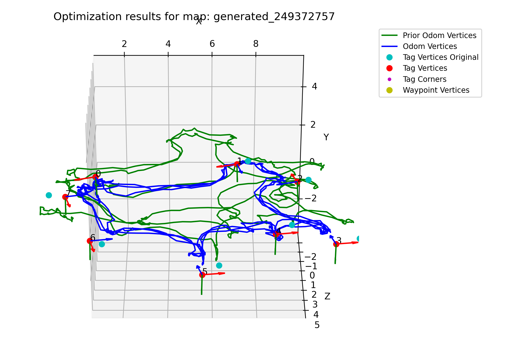

# Invisible Map Generation

> Code base for applying or analyzing nonlinear graph optimization to recorded data sets from the [InvisibleMap](https://github.com/occamLab/InvisibleMap) app (or synthetically generated data sets).

*This repository is a refactor and extension of the work done in [occamlab/assistive_apps](https://github.com/occamLab/assistive_apps/tree/summer2018) to generate maps.*

## Dependencies

- [OCCaM Lab fork of g2opy](https://github.com/occamLab/g2opy) to work with the graphs.
  - Run the [setup_g2opy.sh](setup_g2opy.sh) script to set up this dependency.
    - You may need to install some additional dependencies for the g2opy build to work:
      ```shell
      sudo apt-get -y install cmake build-essential qt5-default libeigen3-dev libsuitesparse-dev python3-dev
      ```
  - The script will automatically source your virtual environment if it exists. If your virtual environment is not in a folder called `./venv/`, then update the `VENV_DIR_REL_PATH` variable in the script such that it can find your virtual environment. Otherwise, the `g2o.cpython-*.so` file will be installed globally.
- Additional Python requirements can be installed using [requirements.txt](requirements.txt): `python3 -m pip install -r requirements.txt`.
  - If you get an error about Matplotlib having a non-GUI backend, run:
    ```shell
    sudo apt-get install -y python3-tk
    ```

## Repository Overview

The primary Python packages are:

- [map_processing/](map_processing): Contains the core optimization functionality.
- [run_scripts/](run_scripts): Contains the scripts that make use of the [map_processing/](map_processing) package.

### Unprocessed Data Set Parsing

The unprocessed graph data sets are described by the [pydantic](https://pydantic-docs.helpmanual.io/) `BaseModel`s in [map_processing/data_set_models.py](map_processing/data_models.py). If a change is made to the way the data sets are serialized on the client side (e.g., by adding or removing a field), this could manifest as a data validation error during decoding in the `Graph.as_graph` class method. Additionally, conventions for row/column ordering in flattened matrices and how the transforms are described can be found by inspection of the `UGDataSet`'s properties (in [map_processing/data_set_models.py](map_processing/data_models.py)).

### Additional Directories

- [archive/](archive): Code that has been replaced or deprecated
- [converted-data/](converted-data): Old data files for previous map types
- [img/](img): Pictures for this README
- [notebooks/](notebooks): Jupyter notebooks
- [saved_sweeps/](saved_sweeps): Saved data files from/for parameter sweeps
- [tests/](tests): Folder containing files for `pytest` unit testing.

## Usage

Note: When using scripts that need to access the Firebase database, the `GOOGLE_APPLICATION_CREDENTIALS` environment variable will need to point to the location of the credentials JSON.

### [graph_manager_user.py](run_scripts/graph_manager_user.py)

The `run_scripts/graph_manager_user.py` script provides a comprehensive set of capabilities via a command line interface. Execute the script with the `-h` flag to see the help message. Some of its capabilities include:

- Acquiring and caching unprocessed maps from the Firebase database.
- Performing standard graph optimization with plotting capabilities.
- Performing a graph optimization comparison routine (see the the `-c` flag in the help message or, for more detail, documentation 
  of the `GraphManager.compare_weights` instance method).
- Performing a parameter sweep (see the `-s` flag in the help message for more information).

#### Examples

1. Cache all unprocessed maps in the Firebase database.

```shell
python3 run_scripts/graph_manager_user.py -f
```

2. Run optimization on all unprocessed maps in the cache matching the pattern `*duncan-occam-room-10-1*48*`; use SBA (`--pso 0`), apply weights corresponding to the weight vector associated with the `5`-valued enum in `GraphManager.WeightSpecifier`, and compute the ground truth metric.

```shell
python3 run_scripts/graph_manager_user.py -v -p "*duncan-occam-room-10-1*48*" --pso 0 -g -w 5
```

3. After running data set generation (see below for more information - example 3 was used, with the added noise argument of `--noise "0.01, 0.001, 0.01, 0.001"`), run an optimization on the resulting generated data set. Use SBA (`--pso 0`), and apply weights corresponding to the weight vector associated with the `5`-valued enum in `GraphManager.WeightSpecifier`. Compute the ground truth metric.

```shell
python3 run_scripts/graph_manager_user.py -v -u -p "generated/generated_249372757.json" --pso 0 -g -w 5 -s
```



Annotated terminal output:

```
# Objective function value before optimization:
unoptimized edges' chi2 sum:         3291.464014902872

# Objective function value before optimization, except only over the gravity edges:
unoptimized gravity edges' chi2 sum: 1.3788241952895202e-12

# Objective function after before optimization:
optimized edges' chi2 sum:           4.382744266039168

# Objective function value after optimization, except only over the gravity edges:
optimized gravity edges' chi2 sum:   0.330115747759974

# Success messages:
Processed map: generated_249372757
Successfully cached /home/duncan/occam/invisible-map-generation/map_processing/../.cache/TestProcessed/generated_249372757.json

# Ground truth metric for tag position estimates (where a negative delta represents an improvement):
Ground truth metric for generated_249372757: 0.24080496509868282 (delta of -0.5928104516846451 from pre-optimization)
```

### [generate_datasets.py](run_scripts/generate_datasets.py)

The [generate_datasets.py](run_scripts/graph_manager_user.py) script provides the capability to generate artificial data sets, either from some parametrically-defined path and set of tag poses, or from an unprocessed recorded data set. In the case of the latter, the poses and un-optimized tag observations are treated as ground truth data from which new observations are generated (with noise optionally being introduced during the simulation). The data set generation integrates with the caching system used by the [graph_manager_user.py](run_scripts/graph_manager_user.py) script, so a common use case is generating a synthetic data set and then using it as the input to optimization. Execute the script with the `-h` flag to see the help message.

Notes:

- Due to the `y` axis being the vertical axis, the data set visualizations (shown with the `-v` flag) appear to be flipped on their side.
- Adding a legend to these graphs is marked as a TODO. In the meantime, to interpret what you are seeing:
  - Red + green + blue reference frames represent odometry poses sampled along the green path. These odometry poses have (optionally) accumulated noise relative to the ground truth path plotted as a dark blue line.
  - Pink reference frames denote the tags' poses.
  - Teal lines represent tag observations made from the odometry poses.

#### Examples

1. Use default tag poses (three tags facing the same direction in a line).

```shell
python3 run_scripts/graph_manager_user -t "3line" -v
```


2. Using the OCCaM room's ground truth tag poses, follow an elliptical path around the interior of the tags. Noise is introduced to the path such that most of the variation is translational in the horizontal directions.

```shell
python3 run_scripts/graph_manager_user --e_cp "3, 5" --e_zw 7 --e_xw 9 --xzp 1.5 -t "occam" --noise "0.01, 0.001, 0.01, 0.001" -v
```


3. Derive from a cached data set the odometry and tag data used to synthesize a data set with no noise; this assumes that the data has already been cached via the `graph_manager_user.py` script.

```shell
python3 run_scripts/graph_manager_user -p d --d_p "*duncan-occam-room-10-1*48*" -v
```


## TODOS

- Continue finding metrics to evaluate optimized map quality.
  - Consider ways of obtaining ground truth data
- Add more ways to consolidate paths in the map to make navigation more efficient
  - Currently, only direct intersections are handled
  - Consider detecting points that have no obstructions between (e.g. connect odometry points that are on different sides of a hallway).
