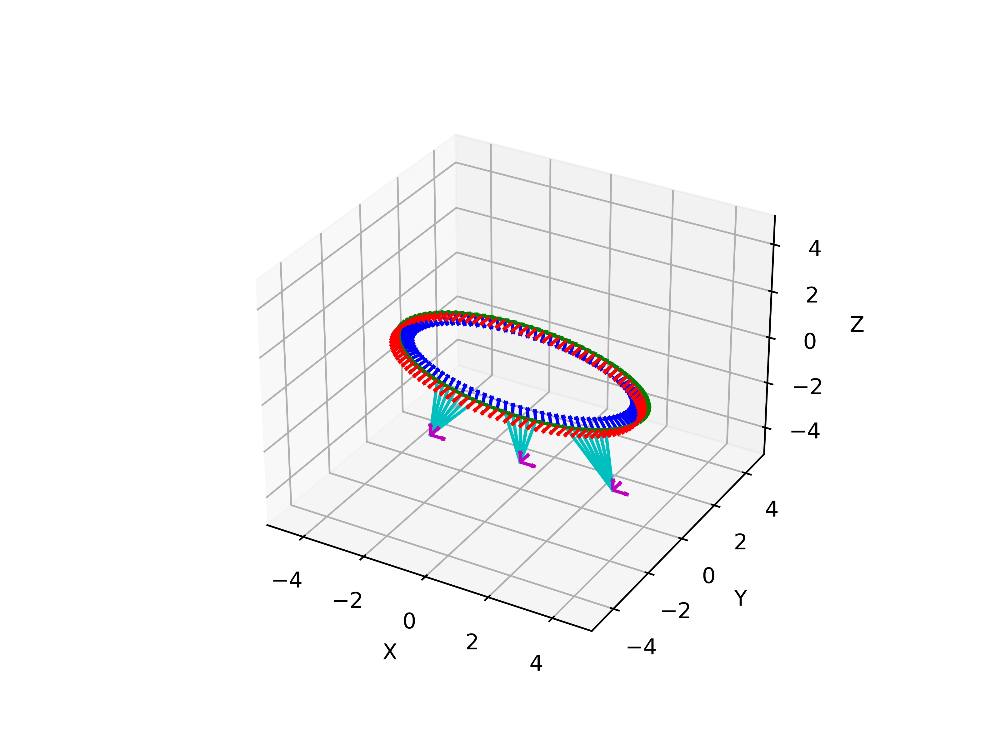
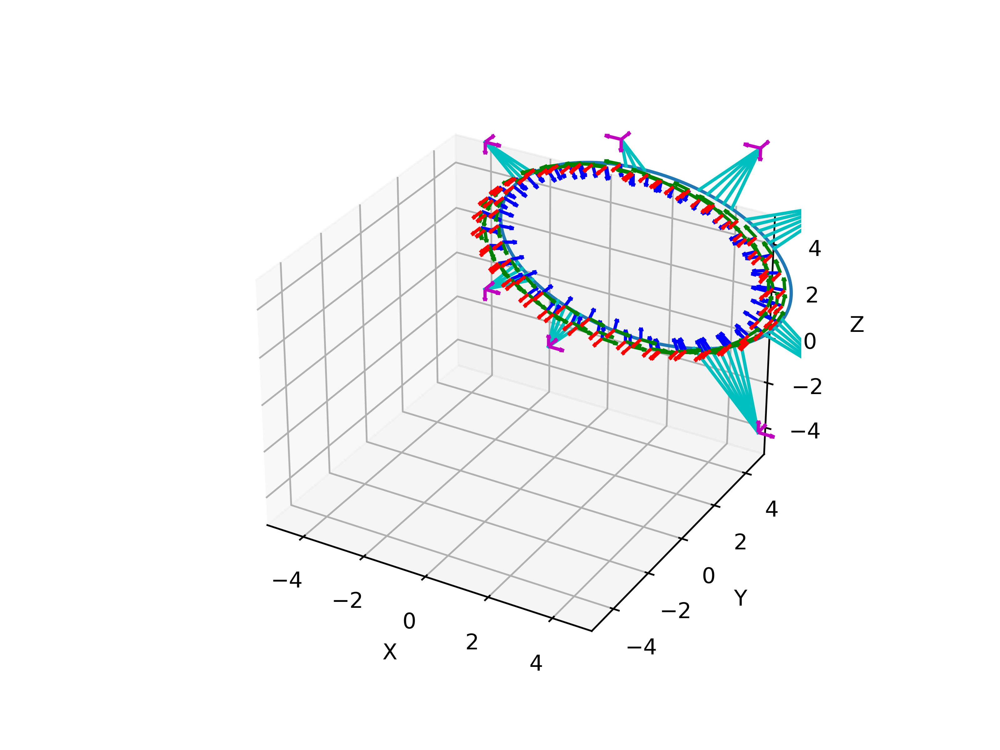

# Invisible Map Generation

This repository is a refactor and extension of the work done in [occamlab/assistive_apps](https://github.com/occamLab/assistive_apps/tree/summer2018) to generate maps.

## Dependencies

- [OCCaM Lab fork of g2opy](https://github.com/occamLab/g2opy) to work with the graphs.
  - Run the setup_g2opy.sh script to set up this dependency
  - The script will automatically source your virtual environment if it exists. If your virtual environment is not in a folder called `./venv/`, then update the `VENV_DIR_REL_PATH` such that it can find your virtual environment. Otherwise, the `g2o.cpython-*.so` file will be installed globally.
- Additional Python requirements can be installed using the included requirements.txt

## Overview

The primary Python packages are:

- `map_processing`: Contains the core optimization functionality.
  - `dataset_generation`: Contains the data set generation functionality.
- `run_scripts`: Contains the scripts that make use of the `map_processing` package.

Refer to each module's docstring for more information. 

### Additional Directories

- `/archive`: Code that has been replaced or deprecated
- `/converted-data`, `/data`: Old data files for previous map types
- `/expectation_maximization`: Previously used maximization model
- `/g2opy_setup`: Setup help and script for g2opy
- `/img`: Pictures for this README
- `/notebooks`: Jupyter notebooks
- `/saved_chi2_sweeps`, `/saved_sweep_results`: Saved data files for parameter sweeps

## Usage

Note: When using scripts that need to access the Firebase database, the `GOOGLE_APPLICATION_CREDENTIALS` environment variable will need to point to the location of the credentials JSON.

### `graph_manager_user.py`

The `run_scripts/graph_manager_user.py` script provides a comprehensive set of capabilities via a command line interface. Execute the script with the `-h` flag to see the help message. Some of its capabilities include:

- Acquiring and caching unprocessed maps from the Firebase database.
- Performing standard graph optimization with plotting capabilities.
- Performing a graph optimization comparison routine (see the the `-c` flag in the help message or, for more detail, documentation 
  of the `GraphManager.compare_weights` instance method).
- Performing a parameter sweep (see the `-s` flag in the help message for more information).

#### Examples

1. Cache all unprocessed maps in the Firebase database.

```shell
python3 run_scripts/graph_manager_user.py -f
```

2. Run optimization on all unprocessed maps in the cache matching the pattern `*duncan-occam-room-10-1*48*`. Use SBA, and apply weights corresponding to the weight vector associated with the `0`-valued enum in `GraphManager.WeightSpecifier`. Compute the ground truth metric.

```shell
python3 run_scripts/graph_manager_user.py -v -p "*duncan-occam-room-10-1*48*" --pso 0 -g -w 0
```

3. After running data set generation (see below for more information), run an optimization parameter sweep on all generated data sets. See the help message for more information on what the parameter sweeping does. Use SBA, and apply weights corresponding to the weight vector associated with the `5`-valued enum in `GraphManager.WeightSpecifier`. Compute the ground truth metric.

```shell
python3 run_scripts/graph_manager_user.py -v -u -p "generated/*.json" --pso 0 -g -w 5 -s
```

### `generate_datasets.py`

The `run_scripts/generate_datasets.py` script provides the capability to generate artificial data sets. It integrates with the caching system used by the `run_scripts/graph_manager_user.py` script, so a common use case is data set, then using it as the input to optimization. Execute the script with the `-h` flag to see the help message.

Note that due to the `y` axis being the vertical axis, the data set visualizations (shown with the `-v` flag) appear to be flipped on their side.  

#### Examples

1. Use default tag poses (three tags facing the same direction in a line).

```shell
python3 run_scripts/graph_manager_user -t "3line" -v
```



2. Using the OCCaM room's ground truth tag poses, follow an elliptical path around the interior of the tags. Noise is introduced to the path such that most of the variation is translational in the horizontal directions.

```shell
python3 run_scripts/graph_manager_user --e_cp "3, 5" --e_zw 7 --e_xw 9 --xzp 1.5 -t "occam" --noise "0.01, 0.001, 0.01, 0.001" -v
```



## TODOS

- Continue finding metrics to evaluate optimized map quality.
  - Consider ways of obtaining ground truth data
- Add more ways to consolidate paths in the map to make navigation more efficient
  - Currently, only direct intersections are handled
  - Consider detecting points that have no obstructions between (e.g. connect odometry points that are on different sides of a hallway).
