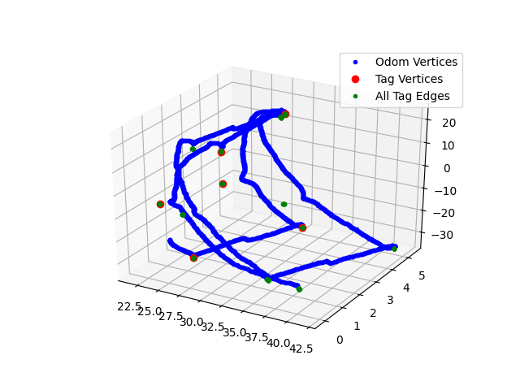
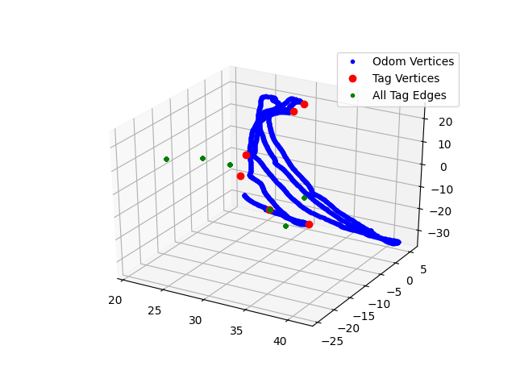

# Invisible Map Generation

This repository is a refactor and extension of the work done in [occamlab/assistive_apps](https://github.com/occamLab/assistive_apps/tree/summer2018) to generate maps.

## Dependencies
- [g2opy](https://github.com/uoip/g2opy) to work with the graphs.
  - There is an issue with newer versions of Eigen, a dependency of g2opy.
    [This pull request](https://github.com/uoip/g2opy/pull/16) fixes it.
  - If g2o is building for the wrong python version, see [this issue](https://github.com/uoip/g2opy/issues/9).

## Source Files
- `graph.py` The new type of graph that uses the python g2o bindings.
- `graph_utils.py`: Contains useful helper functions for graphs, such as converting them to a dict of arrays for plotting or integrating measurements into a path.

## Test Files


## `GraphManager.py` Usage

The `graph_manager_user` script and `GraphManager` class in `GraphManager.py` provides multiple capabilities:

- Acquiring and caching unprocessed maps from the Firebase database.
- Performing standard graph optimization with plotting capabilities.
- Performing a graph optimization comparison routine (see help for the `-c` flag or, for more detail, documentation 
  of the `GraphManager.compare_weights` instance method).

The script is operated through command line arguments. To see the help message, run:

```
python graph_manager_user -h
```

### Example usage

1. Acquire and cache unprocessed maps:

```
python graph_manager_user -f
```

This invokes an infinite loop that listens to the database request, so it will need to be manually quit with Ctrl+C.

2. Run standard graph optimization routine (with visualization turned on) with any maps matching the `glob` pattern (from the `.cache/` directory) of `unprocessed_maps/**/*Marion*`: 

```
python graph_manager_user -p "unprocessed_maps/**/*Marion*" -v
```

3. Run the optimization comparison routine:

```
python graph_manager_user -p "unprocessed_maps/**/*Marion*" -v -c
```

## TODOS
- Find sane weights for g2o.
  - There seems to be a bug in the g2o optimization that may lie in the updating of edge weights (`update_edges` in `graph.py`) or the conversion of a graph to a g2o object (`graph_to_optimizer` in `graph.py`).
    The symptom is an optimized graph where the odometry path is squished and the tags are nowhere near where they should be.
    Adjusting the weights currently seems to do nothing.
    
    For example, commenting out the lines that optimize the graph in `test_json.py` yields the following unoptimized graph, which looks good:
    
    
    
    However, the optimized graph from `test_json.py` looks like this, which somehow moved all of the tag vertices away from the odometry ones and compressed the path:
    
    
    
- Test these weights against a jumpiness metric
  - `get_subgraph` method from `graph.py` can be used to take a path where you walk straight back and forth between two tags repeatedly. A good set of weights would make the optimized subgraph of going back and forth once match the optimized subgraph of going back and forth twice and so on.
