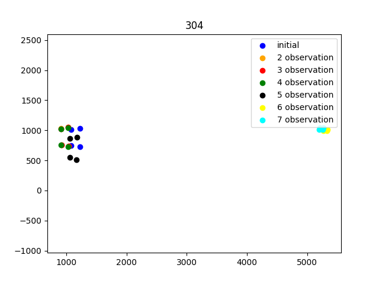

# Benchmarking

[Contact me](mailto:rli@olin.edu) or [Paul Ruvolo](mailto:pruvolo@olin.edu) with questions! I'll try to explain everything here but I've probably missed something.

The benchmarking folder is composed of 4 scripts. They were each designed to benchmark some aspect of the Invisible Map workflow and debug our code. Each script should explain (briefly) what it does at the top, but here is all of the explanations in one place.

Here's a brief overview of the organization of this repository:
- `/datasets/` contains jsons that are used for testing in some way or another. inside this folder, the `sweeped` folder contains the processed results after a sweep. 
- `/debugging_txts/` are txt files of terminal output that helped us both debug and compare results of our tests.
- `/imgs/` are images automatically generated by visualizations. 
- `benchmarking_config.json` is the configuration file of this repository. Our testing configurations are already added to it, but feel free to add more files should you want to test further1

## Oblique v.s. Straight Tag Comparisons
---

`rotational_diff_visualizer.py`

One of the interesting things that we noticed purely experimentally is that our algorithm worked better when tags were observed straight on instead of obliquely. In order to get more information about why that was the case, we wanted to see how the information that Invisible Maps collects changes based upon the type of observation.

This script analyzes the error distribution of oblique tag observations v.s. straight-on tag observations.

---

`error_analysis_quat.py`

While we were doing this, we figured we might as well just spit out the translational error too. 

Analyzing the error distribution of oblique tag observations v.s. straight-on tag observations.

---

## Overlaying Tags

---
This was an effort to evaluate odometry drift's affect on the placement of the tags. Furthermore, this script enabled us to "throw away bad tags," or get rid of tags that were obviously the result of a bugged detection (the corner pixels were too far away from each other). [NOTE: Further development has added things to "throw away bad tags," including tags that aren't straight + tags that are more than a certain distance away.]

`repeat_detection_evaluator.py`

This file takes a path of an unprocessed map, maps out the repeated detections of a tag, then calculates the pixel difference of the corners if those two tags were projected onto the first detection of the tag. We  

The purpose of this test to identify the effect odometry drift/tag detection error has on errors that we see in the invisible map algorithm. If there was no odometry drift and no tag detection error, we would see no difference in the corners of two different detections. However, we can get a sense even from the image above that there are certain conditions which can make a tag fly wildly away from the others. 

---

Building upon this infrastructure, we took in the location of the optimized tags and ran the same kind of workflow, placing the optimized tags on it.

`overlay_tags.py`

Kind of similar to the repeat detection script, this script maps the optimized tag onto the camera frame of each tag detections. This provides a very visual way for us to identify the quality of the optimization.

---

## DATSETS
The datasets that we collected over the summer of 2022 were not very robust, but here's a minimal description of what they were:

`floor_2_obright` - A right-side oblique detection of every tag on the 2nd floor of the MAC, more than once

`floor_2_obleft` -  A left-side oblique detection of every tag on the 2nd floor of the MAC, more than once

`floor_2_right_once`,  A right-side oblique detection of every tag on the 2nd floor of the MAC, once

`209_occam_obleft_once`, to be frank, not certain about this one, but it seems like a left-side detection from classroom 209 to the OCCaM lab, once

`mac-1-2-official`, our official scan of the entire first and second floor of the MAC. Unclear if left/right oblique or straight-on

TODO: Pseudo ground truth. 
